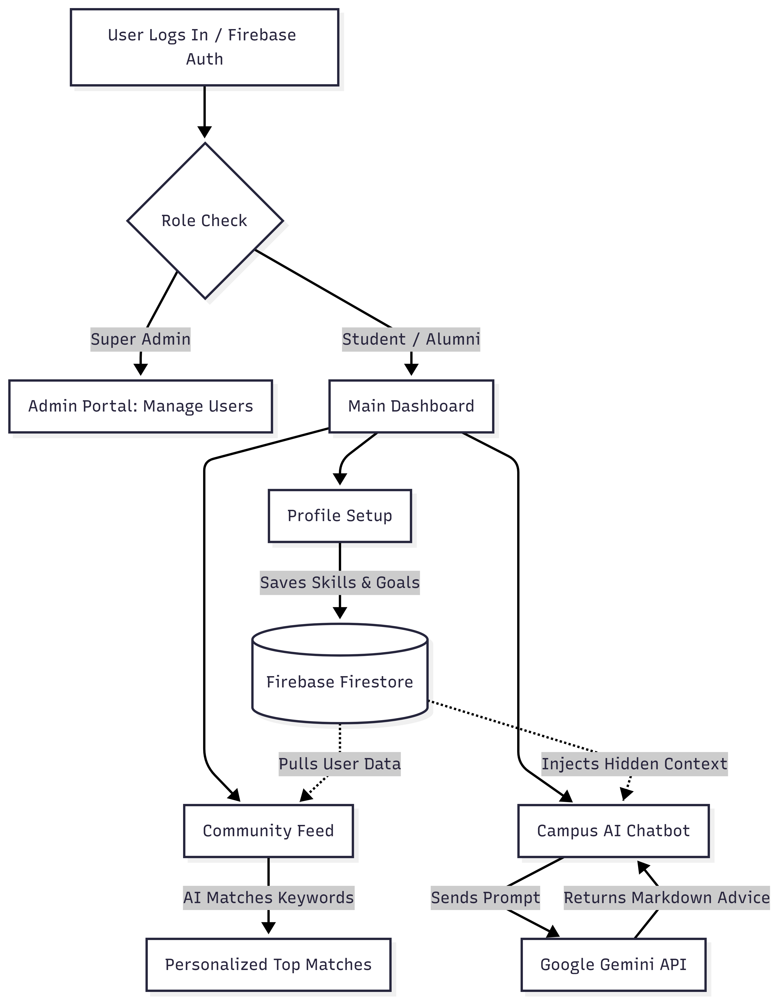

# CampusConnect 🎓
**Team Intellectuals | Track 1**

## 📖 Project Overview
CampusConnect is a role-based, AI-driven social platform designed to solve campus fragmentation. It connects students, alumni, and club presidents through a personalized community feed and an intelligent career advice chatbot. 

## 🗺️ System Workflow

## 🗄️ Deployed Databases & Architecture
Our prototype utilizes **Google Firebase Firestore** as a deployed NoSQL database for real-time synchronization. 
* **`users` collection:** Stores profile data, academic goals, and Role-Based Access Control (RBAC) permissions (e.g., student vs. admin).
* **`communityPosts` collection:** Stores feed interactions, AI-calculated matching scores, and nested comments.

## 🔑 API Keys & Functions
To comply with submission guidelines, our API keys remain in the codebase. Here is how they function within our app:
* **Firebase SDK Keys:** These securely connect our React frontend directly to our deployed Firestore database and manage user authentication sessions.
* **Google Gemini API Key:** This powers our "Campus AI" chatbot. The system secretly injects the user's Firestore profile data (major, skills, goals) into a hidden context prompt before sending it to the Gemini endpoint. This allows the model to return highly personalized, markdown-formatted academic advice.

## ⚙️ Tech Stack
* **Frontend:** React.js, Vite, Tailwind CSS
* **Backend/Database:** Firebase (Auth & Firestore)
* **AI Integration:** Google Gemini API

## 🚀 How to Run Locally
1. Clone this repository.
2. Run `npm install` to download dependencies.
3. Run `npm run dev` to launch the local development server.
